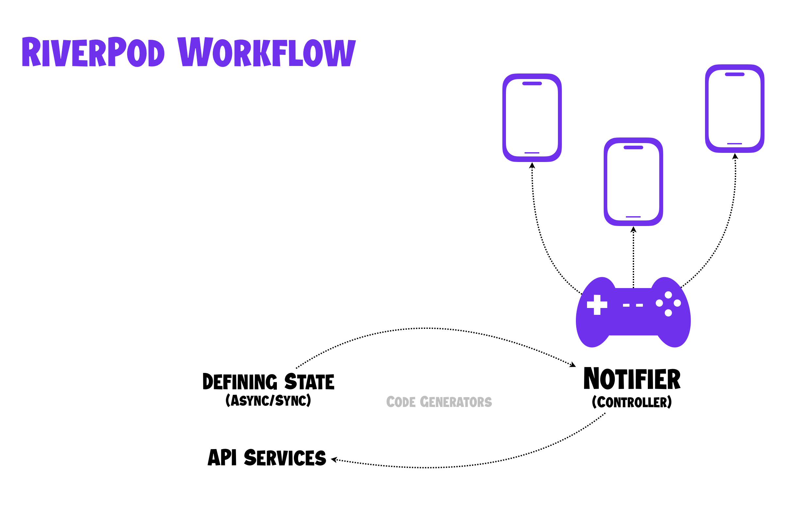

# Flutter High Level Simplified Architecture with Riverpod

[Click to view tutorial 👉🏻](https://www.youtube.com/watch?v=GX0dLN4vxtk)

## How to follow along?

Create a brand new **Flutter** project using the following command.

```bash
flutter create --org com.tutorial --description 'your_description' flutter_tutorial -i swift -a kotlin
```

## Folder Structure Used

- lib/
  - core
    - models
    - screen_controllers
    - services
  - ui
    - screens
    - widgets
  - main.dart

## Tutorial Overview

We will convert this workflow into our flutter project.


