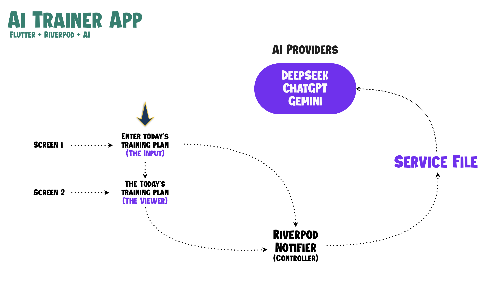

# Flutter + AI: Build an AI Trainer App (2025 Tutorial)

[Click to view tutorial 👉🏻](https://www.youtube.com/watch?v=smjWX2swwv8&list=PLJDAe6L3tk1up4gebuvNn3xxW8u5kmpoV&index=1)

## How to follow along?

Clone the [base](https://github.com/wootcot/flutter-youtube-tutorials/tree/base) branch from this repository and continue with the video.

## Files & Folder Structure Used

- lib/
  - core
    - config
    - models
    - screen_controllers
    - services
  - ui
    - screens
    - widgets
  - .env
  - main.dart
  - build.yaml

## Tutorial Overview

We will cover how to implement AI in Flutter so that you can implement any AI providers like ChatGPT, Deepseek or Gemini in your project. Once you understand these concepts you will be able to use your own imagination to build an AI powered app 💪🏻.

## Other Related Tutorials

- [Flutter High Level Simplified Architecture with Riverpod tutorial 👉🏻](https://www.youtube.com/watch?v=gbHj1EkpuIQ&list=PLJDAe6L3tk1up4gebuvNn3xxW8u5kmpoV&index=1)
