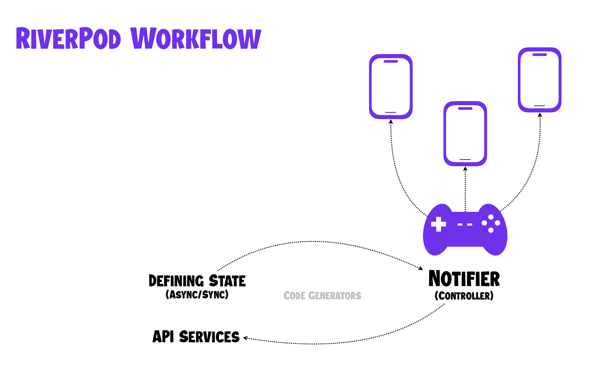
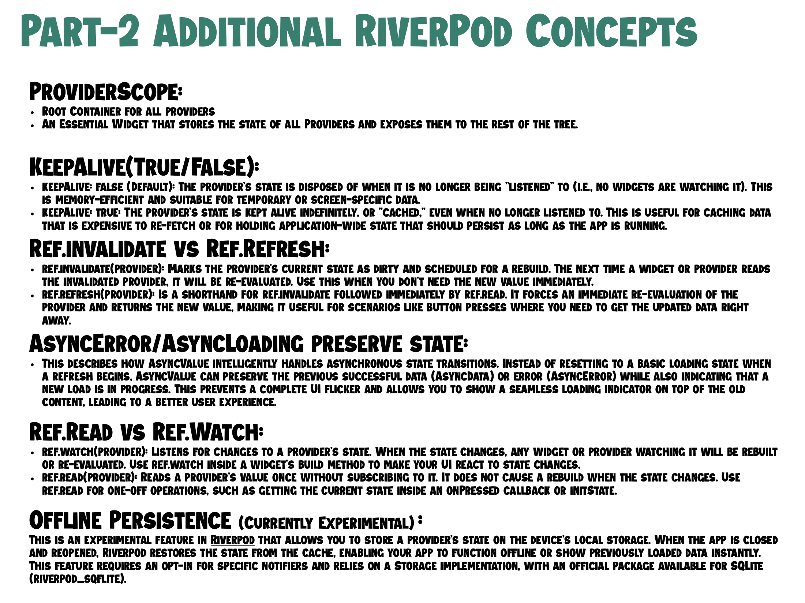

# Part 1: Flutter High Level Simplified Architecture with Riverpod

[Click to view tutorial 👉🏻](https://www.youtube.com/watch?v=gbHj1EkpuIQ&list=PLJDAe6L3tk1up4gebuvNn3xxW8u5kmpoV&index=1)

## How to follow along?

Create a brand new **Flutter** project using the following command to follow along.

```bash
flutter create --org com.tutorial --description 'your_description' flutter_tutorial -i swift -a kotlin
```

## Folder Structure Used

- lib/
  - core
    - models
    - screen_controllers
    - services
  - ui
    - screens
    - widgets
  - main.dart

## Tutorial Overview

We will convert this workflow into our flutter project.



---

# Part 2: Additional Riverpod Concepts - Flutter

[Click to view tutorial 👉🏻](https://youtu.be/fU15nxFKInA)


